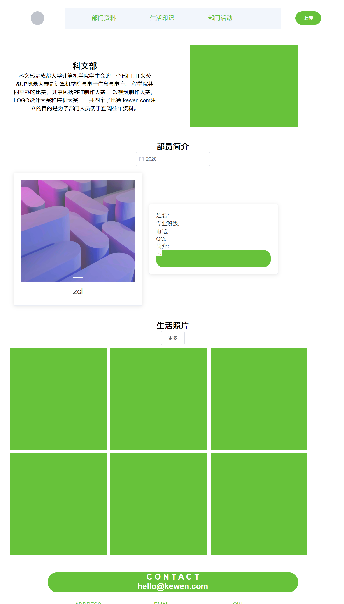

#### 项目结构

```
│  App.vue
│  main.js
│  readme.txt  ---项目结构输出文档
│  
├─assets --本地资源
│      loginbg.png
│      logo.png
│      
├─components  --组件
│      HelloWorld.vue
│      
├─router  -路由
│      index.js
│      
└─views
        Home.vue  --主界面（生活印记）
        Login.vue ---登录
        register.vue ---注册
```

#### 主界面（home)



分为五个部分

1. 导航栏（header）
2. 部门介绍 ，右边的图片可以放最新一届的合照
3. 部员介绍
4. 生活照片
5. 网站信息
